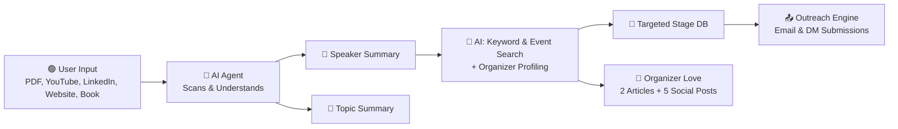

<h1 align="center">🎤 FindMyStage.com</h1>

<p align="center">
  <b>AI-powered automation to help thought leaders land speaking gigs with zero hassle.</b><br>
  Turn your existing content into real-world speaking opportunities – fast.
</p>

<p align="center">
  
  
  
</p>

---

## ✨ What is FindMyStage?

**FindMyStage** is a smart assistant that:

- Analyzes your content (PDFs, YouTube, Website, LinkedIn, or even Books)
- Creates a speaker + topic summary
- Finds matching events and organizers
- Writes outreach content (articles, social posts, and DMs)
- Applies on your behalf

🎯 **Goal**: Save speakers hours of manual work and get them booked faster.

---

## 🔁 How It Works



<h1 align="center">🎤 FindMyStage.com</h1>

<p align="center">
  <b>AI-powered automation to help thought leaders land speaking gigs with zero hassle.</b><br>
  Turn your existing content into real-world speaking opportunities – fast.
</p>

<p align="center">
  
  
  
</p>

⚙️ Inputs We Support
Type Examples
📄 PDF Bio, resume, speaker one-sheet
📺 YouTube Channel or key videos
🌐 Website Blog, portfolio, company
💼 LinkedIn Personal or business profiles
📚 Book Published works or drafts

```

🚀 Features
✅ Zero Manual Research: Finds events and builds organizer DB
✍️ Content Wizard: Auto-generates articles and social media posts
📫 One-Click Outreach: Applies to CFS with aligned messaging
🔎 Smart Matching: Keywords + personality matching for event targeting
```
